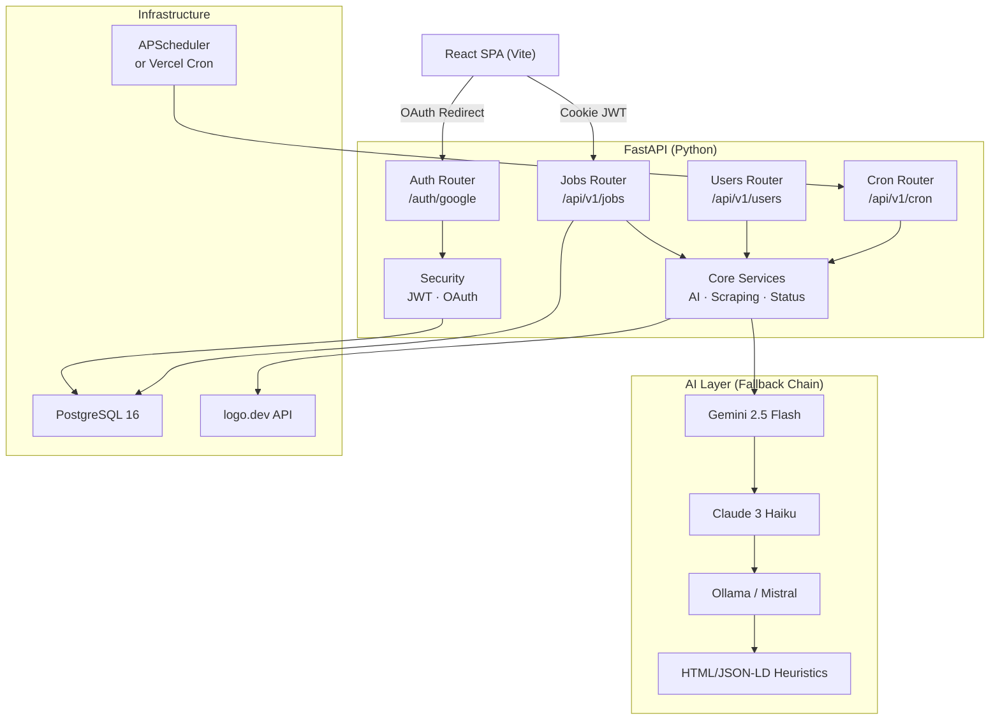

<div align="center">

# JobZen

**AI-powered job application tracker with intelligent resume matching and live listing verification.**


</div>

---

## Project Overview

JobZen is a full-stack SaaS-style job application tracker built to eliminate the friction of a modern job search. It centralizes every aspect of the process — from capturing a posting to tracking outcomes — and augments the workflow with AI at each critical step.

**The core problem** is that serious job seekers manage dozens of concurrent applications across multiple platforms with no single source of truth. Spreadsheets lack intelligence; generic CRM tools are overkill. JobZen is purpose-built for this workflow gap.

**Who it's for:** Active job seekers, especially in tech, who run structured, high-volume searches and want data and AI to guide prioritization.

**Key objectives:**

- Eliminate manual data entry via AI-powered URL scraping
- Give users a quantified signal — not just a feeling — about role fit
- Automatically detect dead/closed listings before wasted follow-up effort
- Persist the full job search as a structured, queryable dataset

---

## Project Highlights

### Intelligence Layer

- **AI Job Scraper** — Paste a job URL; the backend fetches, cleans, and sends the page to an LLM to return structured JSON (title, company, salary, location, work type, description). No manual copy-pasting.
- **Resume Match Scoring** — Uploads a PDF resume, extracts full text, and runs it against any job description through an LLM to return a 0–100 match score with itemized strengths and gaps.
- **Live Listing Verification** — Per-job endpoint that re-scrapes the original URL and uses an LLM to determine if the posting is still accepting applications. Dead listings are auto-flagged.
- **Multi-LLM Fallback Chain** — Gemini → Claude → Ollama → HTML/JSON-LD heuristics. No single point of AI failure.

### Application Management

- **Kanban + Table dual-view** — Switch between a status-column board and a sortable table, both driven from the same state.
- **Full job lifecycle** — Applied → Interviewing → Offer / Rejected / Withdrawn, with PATCH-based partial updates.
- **Company logos** — Automatically resolved via logo.dev from the job URL domain or company name, with intelligent filtering of job board domains.
- **Notes + Description editing** — Inline, optimistic editing with save/cancel controls, no separate edit page.

### Infrastructure & Automation

- **Dual-mode scheduler** — In-process APScheduler for Docker deployments; external Vercel Cron job (`0 18 * * *`) calling a secured HTTP endpoint for serverless deployments. Secret-authenticated via `x-cron-secret` or Bearer token.
- **HTTP-only JWT cookies** — Stateless auth with no `localStorage` exposure. Cookie flags adapt between dev (`secure: false`) and production (`secure: true`, `samesite: lax`).
- **Async throughout** — FastAPI + `asyncpg` + SQLAlchemy async ORM. No blocking I/O anywhere in the hot path.

---

## Technology Stack

| Layer                  | Technology                | Rationale                                                          |
| ---------------------- | ------------------------- | ------------------------------------------------------------------ |
| **Frontend Framework** | React 18 + Vite           | Fast HMR, ESM-native, minimal config overhead                      |
| **Styling**            | Tailwind CSS v3           | Utility-first with consistent design tokens; no runtime CSS        |
| **Charts**             | Recharts                  | Composable, React-native charting for the stats dashboard          |
| **Icons**              | Lucide React              | Consistent, tree-shakeable icon set                                |
| **Date Formatting**    | date-fns                  | Lightweight alternative to moment.js; tree-shakeable               |
| **Drag & Drop**        | dnd-kit                   | Accessible, headless DnD primitives (kanban-ready)                 |
| **Backend Framework**  | FastAPI 0.111             | Native async, automatic OpenAPI, Pydantic v2 validation            |
| **ORM**                | SQLAlchemy 2 (async)      | Typed mapped columns, async session, relationship cascade          |
| **Database**           | PostgreSQL 16             | ACID-compliant, UUID primary keys, indexed enums                   |
| **Migrations**         | Alembic                   | Schema version control, autogenerate support                       |
| **Auth**               | Google OAuth 2.0 + JWT    | No password storage; JWT in HTTP-only cookies                      |
| **AI — Primary**       | Gemini 2.5 Flash          | Fast, cost-efficient; JSON-mode response guaranteed                |
| **AI — Secondary**     | Claude 3 Haiku            | High-quality fallback via Anthropic SDK                            |
| **AI — Tertiary**      | Ollama (Mistral)          | Local/offline fallback; zero API cost                              |
| **HTTP Client**        | httpx (async)             | Async-native, used for scraping and LLM API calls                  |
| **HTML Parsing**       | BeautifulSoup4            | JSON-LD extraction + structural heuristics fallback                |
| **PDF Parsing**        | pypdf                     | Server-side PDF text extraction from uploaded resumes              |
| **Scheduler**          | APScheduler + Vercel Cron | Dual-mode: in-process for Docker, webhook-triggered for serverless |
| **Config**             | pydantic-settings         | Typed, env-file-backed settings with `lru_cache` singleton         |
| **Containerization**   | Docker Compose            | Three-service stack: PostgreSQL, FastAPI, React                    |
| **Deployment**         | Vercel (serverless)       | Zero-infra frontend + Python serverless functions                  |
| **Logo API**           | logo.dev                  | Company logo resolution from domain inference                      |

---

## Architecture

### High-Level Overview

JobZen is a decoupled SPA + API architecture. The React frontend communicates exclusively with the FastAPI backend over a versioned REST API (`/api/v1`). Auth is handled via a redirect-based OAuth flow with the backend issuing a JWT stored in an HTTP-only cookie, which is sent automatically on every subsequent request.



### Request Flow — AI Job Scraping

```
User pastes URL
     │
     ▼
POST /api/v1/jobs/scrape
     │
     ├─► httpx fetches raw HTML (browser UA, follow_redirects)
     │
     ├─► BeautifulSoup strips nav/footer/scripts
     │
     ├─► Text truncated to 12,000 chars for LLM cost control
     │
     ├─► Structured JSON-LD fallback extracted in parallel
     │
     ├─► Gemini 2.5 Flash → Claude Haiku → Ollama → HTML Heuristics
     │
     └─► Returns: { company, title, location, salary, work_type, description }
```

### Request Flow — Resume Match Scoring

```
User clicks "Calculate Match"
     │
     ▼
POST /api/v1/jobs/{id}/analyze
     │
     ├─► Loads user.resume_text + user.profile_summary (combined context)
     │
     ├─► Sends both against job.job_description to LLM
     │
     ├─► LLM returns: { score: float, strengths: [], gaps: [] }
     │
     ├─► Persisted to job.ai_match_score + job.ai_match_explanation (JSON)
     │
     └─► Returns updated Job record
```

### Data Model

```
users ──────────────────────────────────────────────────────┐
│ id (UUID PK)  email  google_id  resume_text  profile_summary │
└────────────────────────────────────────────────────────────┘
         │ 1:N (CASCADE DELETE)
         ▼
       jobs ────────────────────────────────────────────────────────────┐
       │ id  user_id  company_name  job_title  job_url                  │
       │ status (enum)  work_type (enum)  salary_min/max  currency      │
       │ ai_match_score  ai_match_explanation  is_active  last_checked  │
       └────────────────────────────────────────────────────────────────┘
            │ 1:N (CASCADE)
            ├── contacts
            ├── interviews
            ├── documents
            ├── follow_ups
            └── notifications
```

---

## Folder Structure

```
job-tracker/
├── backend/
│   ├── app/
│   │   ├── api/
│   │   │   ├── deps.py          # JWT auth dependency → CurrentUser
│   │   │   └── routes/
│   │   │       ├── auth.py      # Google OAuth + JWT issuance
│   │   │       ├── jobs.py      # Full CRUD + scrape + analyze + check-status
│   │   │       ├── users.py     # Profile update + PDF CV upload
│   │   │       ├── cron.py      # Secured cron trigger endpoint
│   │   │       └── health.py    # Liveness probe
│   │   ├── core/
│   │   │   ├── services.py      # All AI/scraping logic (609 lines)
│   │   │   ├── job_status.py    # Sweep scheduler + per-job refresh
│   │   │   ├── oauth.py         # Google OAuth helpers
│   │   │   └── security.py      # JWT create/decode
│   │   ├── db/
│   │   │   ├── base.py          # Declarative base
│   │   │   ├── session.py       # Async engine + session factory
│   │   │   └── db_url.py        # URL normalization (asyncpg compat)
│   │   ├── models/              # SQLAlchemy ORM models
│   │   ├── schemas/             # Pydantic v2 request/response schemas
│   │   ├── config.py            # pydantic-settings typed config
│   │   └── main.py              # App factory, CORS, router mounts, lifespan
│   ├── alembic/                 # DB migration versions
│   └── Dockerfile
├── frontend/
│   └── src/
│       ├── api/client.js        # Axios instance + typed API methods
│       ├── context/AuthContext.jsx  # Global auth state (useAuth hook)
│       ├── components/          # Layout, Sidebar, Modals, Badges, Toast
│       └── pages/               # Dashboard, Jobs, JobDetail, Settings, Login
├── nginx/                       # Reverse proxy config (Docker mode)
├── docker-compose.yml           # Three-service local stack
├── vercel.json                  # Serverless routing + cron config
└── .env.example
```

---

## Engineering Decisions

### Async-First Backend

Every I/O operation — database queries, HTTP scraping, LLM API calls — is fully async using `asyncpg` and `httpx`. This was a deliberate architectural choice to ensure the API remains responsive under concurrent LLM requests, which can take 5–30 seconds. A synchronous backend would serialize these waits.

### Multi-LLM Fallback Chain

Rather than coupling to a single AI provider, the scraping and analysis services implement a priority waterfall: **Gemini → Claude → Ollama → Heuristics**. Each level is tried independently; if it raises an exception, the next is attempted. This means:

- No single-provider outage breaks the feature
- Local development works without any API keys (Ollama)
- The HTML/JSON-LD fallback ensures some data is always returned

### Stateless Auth via HTTP-only Cookies

Sessions are JWT-based with no server-side session store. The JWT is stored in an HTTP-only cookie (not `localStorage`), preventing XSS-based token theft. The cookie's `secure` and `samesite` flags are toggled by the `environment` config key, keeping dev ergonomics intact.

The Google OAuth flow is entirely server-side (redirect-based), meaning the frontend never handles an access token — only the backend does, issuing its own short-lived JWT before redirecting.

### PATCH-Based Partial Updates

All mutation endpoints use HTTP `PATCH` with `model_dump(exclude_unset=True)`. This means clients only send the fields they intend to change, and the backend applies only those fields to the ORM object. This pattern prevents accidental field zeroing and keeps the API surface honest.

### Dual-Mode Job Status Scheduler

Serverless platforms (Vercel) can't run persistent background threads. The scheduler was designed with two modes:

1. **Docker/self-hosted**: APScheduler runs in-process, triggered on the FastAPI `lifespan` event
2. **Vercel**: A Cron Job calls `GET /api/v1/cron/daily-job-status-sweep` at 18:00 UTC daily, authenticated by a shared secret header

This dual-mode design is toggled by a single `enable_in_process_scheduler` env flag, keeping both deployment targets working without code changes.

### Domain Inference for Company Logos

To fetch company logos automatically, the backend infers the company domain from the job URL's hostname — but only if the host is not a recognized job board (LinkedIn, Indeed, etc.). If the URL is from a generic board, it falls back to constructing `{first_word_of_company_name}.com`. This heuristic is imperfect but fast, with silent failure (no logo shown) as the graceful degradation path.

### Pydantic v2 Settings with `lru_cache`

`pydantic-settings` `BaseSettings` is wrapped in an `lru_cache` factory, meaning the settings object is instantiated once per process and reused everywhere. This prevents repeated `.env` file reads and ensures a single source of truth for configuration.

---

## Technical Highlights

### AI Scraping with JSON-LD Pre-extraction

Before sending HTML to an LLM, the service attempts to extract structured `JobPosting` data from JSON-LD schema blocks embedded in the page. This is a standard SEO pattern used by LinkedIn, Indeed, Greenhouse, and Lever. When JSON-LD is present, it provides clean, machine-readable data without LLM cost. The LLM path serves as a more expensive but universal fallback.

### Resume + Profile Dual-Context Matching

The match scoring endpoint combines two data sources: the raw PDF resume text and the user's free-form "AI Profile Notes" from Settings. Both are concatenated and passed to the LLM together. This lets users annotate preferences (seniority, work style, location constraints) that a resume alone doesn't communicate, giving the scoring model richer context.

### Listing Status Sweep with Rate Limiting

The daily sweep iterates all `is_active=True` jobs with a URL, calling the check endpoint for each. To avoid hammering external job boards and triggering bot detection, a configurable delay (`job_status_check_delay_seconds`, default: 6s) is inserted between each check. When a job is found inactive, its status is automatically transitioned to `withdrawn`.

### Responsive Dual-View Board

The Jobs page renders either a Kanban board or a table — two completely different layout strategies from the same data. The Kanban view groups jobs by status into horizontally scrollable columns, while the table view uses an HTML `<table>` for desktop and a card list for mobile, managed by responsive CSS. View preference is stored in local component state.

### Token-Optimized LLM Prompts

HTML pages are stripped of all `<script>`, `<style>`, `<nav>`, `<footer>`, and `<header>` tags before text extraction. The resulting text is then hard-truncated at **12,000 characters** for scraping and **8,000 characters** for status checks. This keeps LLM token costs predictable and avoids context-window overflow on verbose job postings.

---

## Challenges & Solutions

### Challenge: LLM JSON Reliability

**Problem:** LLMs occasionally wrap JSON responses in markdown code blocks (` ```json `) despite explicit instructions not to, causing `json.loads()` to throw.

**Solution:** A regex post-processing step strips leading ` ```json ` and trailing ` ``` ` from all LLM responses before parsing. Gemini's `response_json=True` mode (`responseMimeType: application/json`) is used where possible to enforce raw JSON at the API level.

**Trade-off:** This adds a minor parsing step but eliminates all JSON formatting failures in practice.

---

### Challenge: Serverless Scheduler Incompatibility

**Problem:** APScheduler relies on a persistent process, which is incompatible with Vercel's serverless function model where each invocation is stateless and ephemeral.

**Solution:** The scheduler was split into two modes gated by an env flag. For Vercel, the daily sweep is triggered by a Vercel Cron Job that sends an authenticated HTTP request to a dedicated endpoint. The endpoint verifies a shared secret before executing the same sweep logic, maintaining functional parity.

**Outcome:** The codebase deploys identically to both Docker and Vercel with no conditional code paths other than the scheduler mode selection at startup.

---

### Challenge: Accurate Company Logo Resolution

**Problem:** Job postings are often hosted on third-party platforms (LinkedIn, Greenhouse, Lever), making the posting URL's hostname useless for logo resolution — it would return a LinkedIn logo, not the company's.

**Solution:** A blocklist of known job board domains is checked against the parsed URL hostname. If the hostname is a job board, the system falls back to constructing a guessed domain from the company name. If the logo API returns an error, the UI falls back to an initial-letter avatar rendered in CSS.

---

### Challenge: Async PDF Text Extraction

**Problem:** `pypdf` is a synchronous library, and calling it inside a FastAPI async endpoint would block the event loop.

**Solution:** The PDF bytes are read into a `BytesIO` buffer (non-blocking read), and `PdfReader` operates on the in-memory buffer rather than a file. Since the operation is CPU-bound and fast for typical resume sizes, it runs acceptably in the async context without offloading to a thread pool. For production scale, this would be a candidate for `asyncio.run_in_executor`.

---

## Lessons Learned

1. **LLM responses need defensive post-processing.** Even with JSON-mode enabled, hardening the parsing pipeline against unexpected formatting (markdown wrappers, trailing text) is essential for production reliability.

2. **Design for two runtimes from the start.** The scheduler problem arose because the initial design assumed a persistent server. Treating serverless as a first-class deployment target from day one would have surfaced this earlier.

3. **Async boundaries require discipline.** Mixing sync libraries (pypdf, BeautifulSoup) into an async codebase works at small scale but needs conscious management. Identifying which operations need `run_in_executor` should be part of the initial tech selection.

4. **Heuristic fallbacks are underrated.** The JSON-LD extraction fallback — implemented as a secondary path — often works better than the LLM for well-structured job sites, at zero cost. Building the fallback chain first revealed this.

5. **Environment parity reduces ops burden.** A single `enable_in_process_scheduler` flag to switch between Docker and Vercel modes eliminated an entire category of "works locally, breaks in prod" issues.

---

## Future Improvements

| Priority | Enhancement                                                                     |
| -------- | ------------------------------------------------------------------------------- |
| High     | Interview scheduler with calendar integration (Google Calendar API)             |
| High     | Email notification system for follow-up reminders and weekly pipeline summaries |
| High     | Drag-and-drop Kanban card reordering with status auto-update via dnd-kit        |
| Medium   | Application analytics: time-to-offer, rejection patterns, source tracking       |
| Medium   | Resume version management (upload and label multiple CV versions)               |
| Medium   | Browser extension to capture job postings directly from the source page         |
| Medium   | Bulk import from LinkedIn / Indeed via CSV export parsing                       |
| Low      | WebSocket-based real-time status updates during AI operations                   |
| Low      | Multi-user organization mode for shared job search sessions                     |
| Low      | GraphQL API layer for more flexible frontend querying                           |

---

## Project Gallery

| Feature                           | Screenshot                                                                     |
| --------------------------------- | ------------------------------------------------------------------------------ |
| **Dashboard & Pipeline Overview** | Snapshot overview with status distribution pie chart and response rate metrics |
| **Kanban Board**                  | Status-column job board with company logos and expired badges                  |
| **AI Match Analysis**             | Per-job match score with strengths/gaps panel generated by LLM                 |
| **URL Auto-Fill**                 | One-click job detail extraction from any posting URL                           |
| **Settings / Resume Upload**      | PDF upload with AI-generated profile summary and notification controls         |

---

## Acknowledgements

- [Gemini API](https://ai.google.dev/) — Primary AI provider for scraping and match scoring
- [Anthropic Claude](https://www.anthropic.com/) — Secondary AI fallback
- [Ollama](https://ollama.com/) — Local LLM runtime for offline/dev use
- [logo.dev](https://logo.dev/) — Company logo resolution API
- [FastAPI](https://fastapi.tiangolo.com/) — Web framework
- [SQLAlchemy](https://www.sqlalchemy.org/) — Async ORM
- [Recharts](https://recharts.org/) — Dashboard charting
- [dnd-kit](https://dndkit.com/) — Drag and drop primitives

---

## License

This project is licensed under the **MIT License**.

---

<div align="center">

Built by [Nico Pangilinan](https://github.com/Nicopangilinan) · 2026

</div>
