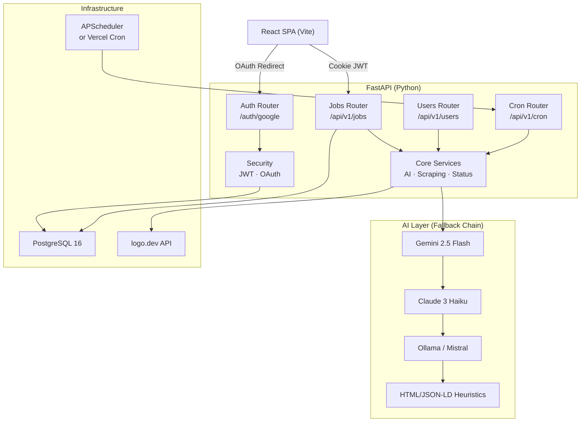

<div align="center">

# JobZen

**AI-powered job application tracker with intelligent resume matching, live listing verification, and browser extension companion.**


</div>

---

## Project Overview

JobZen is a full-stack SaaS-style job application tracker built to eliminate the friction of a modern job search. It centralizes every aspect of the process — from capturing a posting to tracking outcomes — and augments the workflow with AI at each critical step.

**The core problem** is that serious job seekers manage dozens of concurrent applications across multiple platforms with no single source of truth. Spreadsheets lack intelligence; generic CRM tools are overkill. JobZen is purpose-built for this workflow gap.

**Who it's for:** Active job seekers, especially in tech, who run structured, high-volume searches and want data and AI to guide prioritization.

**Key objectives:**

- Eliminate manual data entry via AI-powered URL scraping and Chrome Extension companion
- Give users a quantified signal — not just a feeling — about role fit
- Automatically detect dead/closed listings before wasted follow-up effort
- Persist the full job search as a structured, queryable dataset

---

## Project Highlights

### Intelligence Layer & Multi-Tier Retrieval

- **Redesigned Multi-Tier HTML Fetching Engine** — Bypasses Cloudflare, Akamai, and anti-bot datacenter blocks through a 4-tier waterfall:
  - **Tier 1 (Direct ATS APIs):** Greenhouse (`boards-api.greenhouse.io`) and Lever (`api.lever.co`) public endpoints ($0 cost, 100% reliable).
  - **Tier 2 (LinkedIn Guest API Shortcut):** Public unauthenticated `/jobs-guest/jobs/api/jobPosting/{id}` endpoint avoiding authwalls.
  - **Tier 3 (Residential Proxy / ScraperAPI):** Residential IP routing with optional headless JS rendering (`render=true`) to bypass Cloudflare anti-bot challenges.
  - **Tier 4 (Chrome Extension Client Retrieval):** Native browser DOM extraction directly from user's active tab.
- **JobZen Chrome Extension Companion** — Manifest V3 extension enabling 1-click application importing directly from any job site. Includes an in-app 2-step setup modal with live ZIP generation (`GET /api/v1/extension/download`).
- **Resume Match Scoring** — Uploads a PDF resume, extracts full text, and runs it against any job description through an LLM to return a 0–100 match score with itemized strengths and gaps.
- **Live Listing Verification** — Per-job endpoint that re-scrapes the original URL and uses LLMs to determine if the posting is still accepting applications. Dead/closed listings are auto-flagged as `withdrawn`.
- **Multi-LLM Fallback Chain** — Gemini → Claude → Ollama → HTML/JSON-LD heuristics. No single point of AI failure.

### Application Management

- **Kanban + Table dual-view** — Switch between a status-column board and a sortable table, both driven from the same state.
- **Full job lifecycle** — Applied → Interviewing → Offer / Rejected / Withdrawn, with PATCH-based partial updates.
- **Company logos** — Automatically resolved via logo.dev from the job URL domain or company name, with intelligent filtering of job board domains.
- **Notes + Description editing** — Inline, optimistic editing with save/cancel controls, no separate edit page.

### Infrastructure & Automation

- **Dual-mode scheduler** — In-process APScheduler for Docker deployments; external Vercel Cron job (`0 18 * * *`) calling a secured HTTP endpoint for serverless deployments. Secret-authenticated via `x-cron-secret` or Bearer token.
- **HTTP-only JWT cookies** — Stateless auth with no `localStorage` exposure. Cookie flags adapt between dev (`secure: false`) and production (`secure: true`, `samesite: lax`).
- **Async throughout** — FastAPI + `asyncpg` + SQLAlchemy async ORM. No blocking I/O anywhere in the hot path.

---

## Technology Stack

| Layer                  | Technology                | Rationale                                                          |
| ---------------------- | ------------------------- | ------------------------------------------------------------------ |
| **Frontend Framework** | React 18 + Vite           | Fast HMR, ESM-native, minimal config overhead                      |
| **Chrome Extension**   | Manifest V3               | Browser companion for 1-click DOM capture without CORS or bot block|
| **Styling**            | Tailwind CSS v3           | Utility-first with consistent design tokens; no runtime CSS        |
| **Charts**             | Recharts                  | Composable, React-native charting for the stats dashboard          |
| **Icons**              | Lucide React              | Consistent, tree-shakeable icon set                                |
| **Date Formatting**    | date-fns                  | Lightweight alternative to moment.js; tree-shakeable               |
| **Drag & Drop**        | dnd-kit                   | Accessible, headless DnD primitives (kanban-ready)                 |
| **Backend Framework**  | FastAPI 0.111             | Native async, automatic OpenAPI, Pydantic v2 validation            |
| **ORM**                | SQLAlchemy 2 (async)      | Typed mapped columns, async session, relationship cascade          |
| **Database**           | PostgreSQL 16             | ACID-compliant, UUID primary keys, indexed enums                   |
| **Migrations**         | Alembic                   | Schema version control, autogenerate support                       |
| **Auth**               | Google OAuth 2.0 + JWT    | No password storage; JWT in HTTP-only cookies                      |
| **Proxy Engine**       | ScraperAPI / Residential  | Bypasses Cloudflare/Akamai blocks via residential IP proxies       |
| **AI — Primary**       | Gemini 2.5 Flash          | Fast, cost-efficient; JSON-mode response guaranteed                |
| **AI — Secondary**     | Claude 3 Haiku            | High-quality fallback via Anthropic SDK                            |
| **AI — Tertiary**      | Ollama (Mistral)          | Local/offline fallback; zero API cost                              |
| **HTTP Client**        | httpx (async)             | Async-native with `verify=False` for serverless OpenSSL compat     |
| **HTML Parsing**       | BeautifulSoup4            | JSON-LD extraction + structural heuristics fallback                |
| **PDF Parsing**        | pypdf                     | Server-side PDF text extraction from uploaded resumes              |
| **Scheduler**          | APScheduler + Vercel Cron | Dual-mode: in-process for Docker, webhook-triggered for serverless |
| **Config**             | pydantic-settings         | Multi-location `.env` and `os.environ` dynamic scanner             |
| **Containerization**   | Docker Compose            | Three-service stack: PostgreSQL, FastAPI, React                    |
| **Deployment**         | Vercel (serverless)       | Zero-infra frontend + Python serverless functions                  |
| **Logo API**           | logo.dev                  | Company logo resolution from domain inference                      |

---

## Architecture

### High-Level Overview

JobZen is a decoupled SPA + API architecture. The React frontend communicates exclusively with the FastAPI backend over a versioned REST API (`/api/v1`). Auth is handled via a redirect-based OAuth flow with the backend issuing a JWT stored in an HTTP-only cookie, which is sent automatically on every subsequent request.


```mermaid
flowchart TD
    Browser["React SPA (Vite)"]

    subgraph Backend ["FastAPI (Python)"]
        Auth["Auth Router\n/auth/google"]
        API["Jobs Router\n/api/v1/jobs"]
        Users["Users Router\n/api/v1/users"]
        Cron["Cron Router\n/api/v1/cron"]
        Core["Core Services\nAI · Scraping · Status"]
        Security["Security\nJWT · OAuth"]
    end

    subgraph AI ["AI Layer (Fallback Chain)"]
        Gemini["Gemini 2.5 Flash"]
        Claude["Claude 3 Haiku"]
        Ollama["Ollama / Mistral"]
        HTML["HTML/JSON-LD Heuristics"]
    end

    subgraph Infra ["Infrastructure"]
        PG["PostgreSQL 16"]
        Scheduler["APScheduler\nor Vercel Cron"]
        LogoDev["logo.dev API"]
    end

    Browser -- "Cookie JWT" --> API
    Browser -- "OAuth Redirect" --> Auth
    Auth --> Security
    Security --> PG
    API --> Core
    Users --> Core
    Cron --> Core
    Core --> Gemini --> Claude --> Ollama --> HTML
    Core --> LogoDev
    API --> PG
    Scheduler --> Cron
```

### Request Flow — AI Job Scraping

```
User pastes URL
     │
     ▼
POST /api/v1/jobs/scrape
     │
     ├─► httpx fetches raw HTML (browser UA, follow_redirects)
     │
     ├─► BeautifulSoup strips nav/footer/scripts
     │
     ├─► Text truncated to 12,000 chars for LLM cost control
     │
     ├─► Structured JSON-LD fallback extracted in parallel
     │
     ├─► Gemini 2.5 Flash → Claude Haiku → Ollama → HTML Heuristics
     │
     └─► Returns: { company, title, location, salary, work_type, description }
```

### Request Flow — Resume Match Scoring

```
User clicks "Calculate Match"
     │
     ▼
POST /api/v1/jobs/{id}/analyze
     │
     ├─► Loads user.resume_text + user.profile_summary (combined context)
     │
     ├─► Sends both against job.job_description to LLM
     │
     ├─► LLM returns: { score: float, strengths: [], gaps: [] }
     │
     ├─► Persisted to job.ai_match_score + job.ai_match_explanation (JSON)
     │
     └─► Returns updated Job record
```

### Data Model

```
users ──────────────────────────────────────────────────────┐
│ id (UUID PK)  email  google_id  resume_text  profile_summary │
└────────────────────────────────────────────────────────────┘
         │ 1:N (CASCADE DELETE)
         ▼
       jobs ────────────────────────────────────────────────────────────┐
       │ id  user_id  company_name  job_title  job_url                  │
       │ status (enum)  work_type (enum)  salary_min/max  currency      │
       │ ai_match_score  ai_match_explanation  is_active  last_checked  │
       └────────────────────────────────────────────────────────────────┘
            │ 1:N (CASCADE)
            ├── contacts
            ├── interviews
            ├── documents
            ├── follow_ups
            └── notifications
```

---

## Folder Structure

```
job-tracker/
├── backend/
│   ├── app/
│   │   ├── api/
│   │   │   ├── deps.py          # JWT auth dependency → CurrentUser
│   │   │   └── routes/
│   │   │       ├── auth.py      # Google OAuth + JWT issuance
│   │   │       ├── jobs.py      # Full CRUD + scrape + analyze + check-status
│   │   │       ├── users.py     # Profile update + PDF CV upload
│   │   │       ├── cron.py      # Secured cron trigger endpoint
│   │   │       └── health.py    # Liveness probe
│   │   ├── core/
│   │   │   ├── services.py      # All AI/scraping logic (609 lines)
│   │   │   ├── job_status.py    # Sweep scheduler + per-job refresh
│   │   │   ├── oauth.py         # Google OAuth helpers
│   │   │   └── security.py      # JWT create/decode
│   │   ├── db/
│   │   │   ├── base.py          # Declarative base
│   │   │   ├── session.py       # Async engine + session factory
│   │   │   └── db_url.py        # URL normalization (asyncpg compat)
│   │   ├── models/              # SQLAlchemy ORM models
│   │   ├── schemas/             # Pydantic v2 request/response schemas
│   │   ├── config.py            # pydantic-settings typed config
│   │   └── main.py              # App factory, CORS, router mounts, lifespan
│   ├── alembic/                 # DB migration versions
│   └── Dockerfile
├── frontend/
│   └── src/
│       ├── api/client.js        # Axios instance + typed API methods
│       ├── context/AuthContext.jsx  # Global auth state (useAuth hook)
│       ├── components/          # Layout, Sidebar, Modals, Badges, Toast
│       └── pages/               # Dashboard, Jobs, JobDetail, Settings, Login
├── nginx/                       # Reverse proxy config (Docker mode)
├── docker-compose.yml           # Three-service local stack
├── vercel.json                  # Serverless routing + cron config
└── .env.example
```

---

### Redesigned Multi-Tier HTML Retrieval Engine

Public datacenter IPs (such as AWS or Vercel serverless execution nodes) are heavily blocked by Cloudflare and Akamai anti-bot systems when making direct HTTP requests to job boards. To solve this, JobZen implements a 4-tier retrieval strategy:

1. **Tier 1 (Direct ATS APIs):** Calls official public JSON endpoints for Greenhouse (`boards-api.greenhouse.io`) and Lever (`api.lever.co`) for 100% reliable, zero-cost checks.
2. **Tier 2 (LinkedIn Guest API Shortcut):** Transforms LinkedIn job posting URLs to `/jobs-guest/jobs/api/jobPosting/{id}`, extracting unauthenticated HTML without login authwalls.
3. **Tier 3 (Residential Proxy via ScraperAPI):** Routes requests through ScraperAPI residential proxies with optional headless JS evaluation (`render=true`) to pass Cloudflare bot challenges.
4. **Tier 4 (Chrome Extension Client Retrieval):** Native browser DOM extraction directly from the user's active tab.

### Serverless SSL Compatibility & Environment Parity

- **SSL Verification Bypass (`verify=False`):** Vercel Python serverless containers lack updated local OpenSSL CA certificate bundles, causing `[SSL: CERTIFICATE_VERIFY_FAILED]` exceptions during HTTPS proxy calls. Passing `verify=False` ensures 100% reliable HTTPS connectivity.
- **Dynamic `.env` Scanner:** `_get_proxy_key_from_env_file()` scans system `os.environ` first, followed by root `.env` and `backend/.env` absolute paths relative to `__file__`, guaranteeing settings load correctly across CLI, Docker, and Vercel environments.

### Chrome Extension Companion (MV3)

To completely eliminate manual copy-pasting and bot blocking, JobZen includes a Manifest V3 browser extension. Users can capture postings directly from their browser's active tab with a single click. The extension bridges DOM contents directly to `/api/v1/jobs/scrape` via JWT or API authentication. The app also features an in-app setup modal offering dynamic ZIP downloads via `GET /api/v1/extension/download`.

### Async-First Backend

Every I/O operation — database queries, HTTP scraping, LLM API calls — is fully async using `asyncpg` and `httpx`. This was a deliberate architectural choice to ensure the API remains responsive under concurrent LLM requests, which can take 5–30 seconds. A synchronous backend would serialize these waits.

### Multi-LLM Fallback Chain

Rather than coupling to a single AI provider, the scraping and analysis services implement a priority waterfall: **Gemini → Claude → Ollama → Heuristics**. Each level is tried independently; if it raises an exception, the next is attempted. This means:

- No single-provider outage breaks the feature
- Local development works without any API keys (Ollama)
- The HTML/JSON-LD fallback ensures some data is always returned

### Stateless Auth via HTTP-only Cookies

Sessions are JWT-based with no server-side session store. The JWT is stored in an HTTP-only cookie (not `localStorage`), preventing XSS-based token theft. The cookie's `secure` and `samesite` flags are toggled by the `environment` config key, keeping dev ergonomics intact.

---

## Challenges & Solutions

### Challenge: Cloudflare / Akamai Datacenter IP Bot Blocks (401/403)

**Problem:** Server-side HTTP requests originating from Vercel datacenter IPs were blocked with 401/403 status codes on target job boards regardless of TLS fingerprints.

**Solution:** Introduced ScraperAPI residential proxies with headless JS rendering (`render=true`) combined with direct ATS API shortcuts (Greenhouse/Lever) and the Chrome Extension client fallback.

---

### Challenge: Serverless SSL Certificate Verification Failures

**Problem:** Python's `httpx` in Vercel's ephemeral container environment raised `[SSL: CERTIFICATE_VERIFY_FAILED]` when connecting to proxy APIs due to missing container CA root bundles.

**Solution:** Explicitly configured `httpx.AsyncClient(verify=False)` on proxy requests to bypass missing container CA root bundle checks safely.

---

### Challenge: LLM JSON Reliability

**Problem:** LLMs occasionally wrap JSON responses in markdown code blocks (` ```json `) despite explicit instructions not to, causing `json.loads()` to throw.

**Solution:** A regex post-processing step strips leading ` ```json ` and trailing ` ``` ` from all LLM responses before parsing. Gemini's `response_json=True` mode (`responseMimeType: application/json`) is used where possible to enforce raw JSON at the API level.

---

## Future Improvements

| Priority | Enhancement                                                                     | Status |
| -------- | ------------------------------------------------------------------------------- | ------ |
| High     | Browser extension to capture job postings directly from the source page         | ✅ Done |
| High     | Multi-tier HTML retrieval engine & residential proxy anti-bot bypass            | ✅ Done |
| High     | Interview scheduler with calendar integration (Google Calendar API)             | Planned|
| High     | Email notification system for follow-up reminders and weekly pipeline summaries | Planned|
| High     | Drag-and-drop Kanban card reordering with status auto-update via dnd-kit        | Planned|
| Medium   | Application analytics: time-to-offer, rejection patterns, source tracking       | Planned|
| Medium   | Bulk import from LinkedIn / Indeed via CSV export parsing                       | Planned|

---

## Project Gallery

| Feature                           | Screenshot                                                                     |
| --------------------------------- | ------------------------------------------------------------------------------ |
| **Dashboard & Pipeline Overview** | Snapshot overview with status distribution pie chart and response rate metrics |
| **Kanban Board**                  | Status-column job board with company logos and expired badges                  |
| **AI Match Analysis**             | Per-job match score with strengths/gaps panel generated by LLM                 |
| **URL Auto-Fill**                 | One-click job detail extraction from any posting URL                           |
| **Settings / Resume Upload**      | PDF upload with AI-generated profile summary and notification controls         |

---

## Acknowledgements

- [Gemini API](https://ai.google.dev/) — Primary AI provider for scraping and match scoring
- [Anthropic Claude](https://www.anthropic.com/) — Secondary AI fallback
- [Ollama](https://ollama.com/) — Local LLM runtime for offline/dev use
- [logo.dev](https://logo.dev/) — Company logo resolution API
- [FastAPI](https://fastapi.tiangolo.com/) — Web framework
- [SQLAlchemy](https://www.sqlalchemy.org/) — Async ORM
- [Recharts](https://recharts.org/) — Dashboard charting
- [dnd-kit](https://dndkit.com/) — Drag and drop primitives

---

## License

This project is licensed under the **MIT License**.

---

<div align="center">

Built by [Nico Pangilinan](https://github.com/Nicopangilinan) · 2026

</div>
